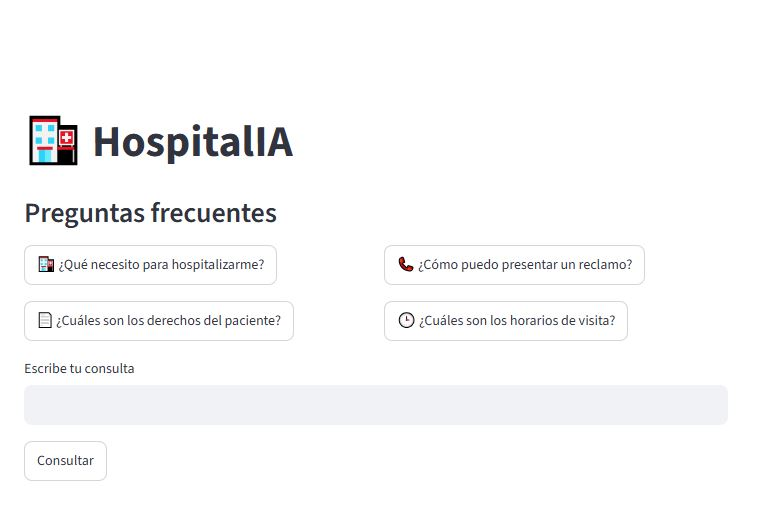
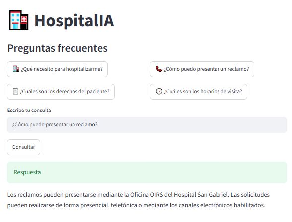
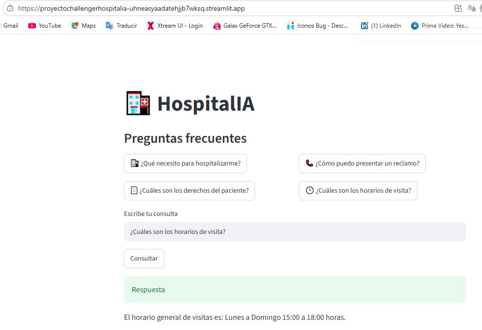

# HospitalIA

HospitalIA es un asistente inteligente desarrollado para ayudar a pacientes y familiares a resolver dudas frecuentes mediante la consulta de la documentación institucional del Hospital San Gabriel.

El proyecto implementa una arquitectura **RAG (Retrieval-Augmented Generation)**, que permite recuperar información relevante desde documentos PDF y generar respuestas claras y fundamentadas utilizando modelos de inteligencia artificial. Además, incorpora un agente basado en **LangGraph** que analiza la intención de cada consulta para determinar el flujo más adecuado antes de generar una respuesta.

## 🚀 Tecnologías utilizadas

- Python 3.13
- LangChain
- LangGraph
- Google Gemini
- FAISS
- PyMuPDF
- python-dotenv

## ⚙️ Instalación

### 1. Clonar el repositorio

```bash
git clone https://github.com/acfdevelop/proyecto_challenger_hospitalia.git
cd hospitalia-rag
```

### 2. Instalar las dependencias

```bash
pip install -r requirements.txt
```

### 3. Configurar la API de Gemini

Crear un archivo `.env` con el siguiente contenido:

```env
GEMINI_API_KEY=TU_API_KEY
```

## 📌 ¿Cómo funciona?

El flujo general del asistente es el siguiente:

1. El usuario realiza una pregunta.
2. El agente ejecuta un nodo de triaje, encargado de identificar la intención de la consulta.
3. Según el resultado del triaje, el agente puede:
   - Responder utilizando la documentación institucional mediante RAG.
   - Solicitar información adicional al usuario.
   - Derivar la consulta a un proceso de apertura de ticket.
4. Si la consulta debe resolverse mediante RAG:
   - Se realiza una búsqueda semántica en el índice vectorial FAISS.
   - Se recuperan los fragmentos de documentos más relevantes.
   - El contexto recuperado se envía al modelo Gemini.
   - Gemini genera una respuesta utilizando únicamente la información encontrada en la documentación.

## 📂 Estructura del proyecto

```text
hospitalia-rag/
│
├── documentos/        # Documentación institucional en formato PDF
├── vectorstore/       # Índice vectorial FAISS
├── app.py             # Punto de entrada de la aplicación
├── agente.py          # Orquestación mediante LangGraph
├── rag.py             # Carga de documentos, embeddings y consultas RAG
├── triaje.py          # Clasificación de la intención del usuario
├── prompts.py         # Prompts utilizados por el asistente
├── .env               # Variables de entorno
└── README.md
```

# ▶ Ejecutar HospitalIA

```bash
python app.py

```
## 🌐 Demo

🚀 **[Probar HospitalIA en Streamlit](https://proyectochallengerhospitalia-uhneasyaadatehjjb7wksq.streamlit.app/)**

# Ejemplos de uso

### Consulta 1

**Pregunta**

```
¿Qué necesito para hospitalizarme?
```

**Respuesta**

```
Para hospitalizarse deberá presentar...
```

---

### Consulta 2

**Pregunta**

```
¿Cómo puedo presentar un reclamo?
```

**Respuesta**

```
Para ingresar un reclamo deberá proporcionar su nombre, cédula de identidad, teléfono o correo electrónico, la fecha aproximada del hecho, el servicio involucrado y una descripción clara de la situación.
```

---

### Consulta 3

**Pregunta**

```
¿Cuáles son los horarios de visita?
```

**Respuesta**

```
El horario de visitas es de lunes a domingo entre las 15:00 y las 18:00 horas.
```

---

## 📸 Capturas de pantalla






## 🎥 Video demostración

<a href="assets/demo.mp4">▶ Ver video de demostración</a>